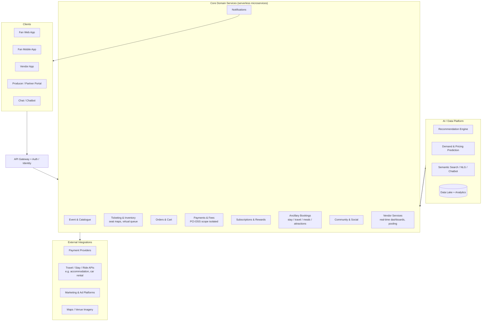

# BMSx — Product Requirements Document (v2)

**Product:** BMSx 360° Festival Ticketing Platform
**Author:** Nitish (drafted with Claude)
**Date:** 23 August 2026
**Status:** Draft for review
**Sources:** BMSx Corporate Presentation v45, Wireframe notes, AI-powered homepage analysis
**Provenance:** promoted from `References/TAG_PRD_v1.md` on 2026-08-23 — renamed TAG→BMSx throughout (the earlier draft predates the product's TAG→BMSx rename). Supersedes the original `BMSx_PRD.md` (v1.0) as the pinned build-scope document; that file is retained at `archive/BMSx_PRD_v1_business_source.md` as the original business/investor-facing source this PRD draws its market and revenue data from.

---

## 1. Problem Statement

Event ticketing today is dominated by monopolies/oligopolies with little incentive to innovate: fans face high, unexplainable fees, unreliable service, little choice of amenities, and almost no control over their overall event experience. Vendors have no collaborative real-time communication with festival production, are not integrated into the festival ecosystem, and cannot budget reliably for events. Festival companies lack visibility measurement history and carry poor customer-service reputations.

The festivals segment specifically is unsaturated — research identifies only one homegrown competitor (US-based, minimal traction in 10 years) — while major European festivals draw audiences of 210K–600K each (Tomorrowland 600K, Primavera Sound 500K, ADE 450K, Sziget 450K, Pol'and'Rock 400K, Glastonbury 210K). No incumbent (Ticketmaster, Eventbrite, SeatGeek, et al.) offers a full 360° experience — ticketing plus travel, stay, dining, merchandise, and community — and none makes heavy use of AI for prediction and personalisation (per the Platform Analysis snapshot).

**Cost of not solving:** fans continue to assemble festival trips across 5+ separate apps (tickets, flights, hotels, rides, meals); BMSx forfeits the 45% of modelled revenue that comes from partnership fees and the retention advantage of owning the whole journey.

---

## 2. Product Vision

BMSx is a 360° festival solutions platform, not a ticketing transaction company. It serves three sides of the market:

- **Fans:** one app for tickets + accommodation, travel, meals, merchandise, local attractions, social features, and rewards — with an elevated UI/UX and transparent fees.
- **Vendors:** a dedicated app integrated with the BMSx platform, with real-time functionality and resource pooling.
- **Festival companies/producers:** ML/AI predictive tooling, a next-generation platform, and secondary-market abuse mitigation through 360° transparency.

Launch in Europe (incorporated in Ireland), then expand to emerging markets such as India (festivals of light and colour identified as opportunities).

---

## 3. Goals

| # | Goal | Type | Target |
|---|------|------|--------|
| G1 | Convert landing-page visitors into event discovery | User | ≥ 40% of visitors interact with search or a category within the first session [TBD: baseline needed] |
| G2 | Drive attach of ancillary services (stay/travel/meals) to ticket purchases | Business | ≥ 15% of ticket orders include ≥ 1 ancillary booking within 90 days of launch [TBD: validate target] |
| G3 | Establish subscription revenue | Business | ≥ 5% of active buyers on Basic or Premium within 6 months [TBD: validate target] |
| G4 | Reduce checkout abandonment vs. incumbent norms | User | Checkout completion ≥ 70% from cart start [TBD: industry benchmark] |
| G5 | Onboard vendor ecosystem for launch festivals | Business | ≥ 20 vendors live per launch festival [TBD: confirm with partnerships] |

Goals are outcomes; the landing-page optimisation, journeys, and architecture below are the means.

---

## 4. Non-Goals (v1)

1. **General (non-festival) ticketing at scale** — the supply chain research covers movie theatres, colleges, casinos, etc., but v1 focuses on the festival vertical where the competitive gap is proven. General ticketing is a later phase.
2. **Secondary-market resale marketplace** — v1 mitigates secondary-market abuse via transparency; building a resale exchange is a separate, regulatory-heavy initiative.
3. **B2B white-label single-festival solution** — named in the business model strategy, but deferred so the consumer (B2C aggregated) app ships first.
4. **India market launch** — architecture must not preclude it (multi-currency, multi-language, DPDP Act readiness), but v1 ships for Europe only.
5. **Festival production services (Festival Doctor, consultancy, programming, etc.)** — these are service lines, not platform features; they need no v1 product surface beyond a contact/lead form.
6. **Native vendor hardware/POS integrations** — vendor app v1 is software-only.

---

## 5. Personas

### P1 — Freya, the International Festival Traveller (primary)
- 24–34, attends 2–4 festivals a year, at least one abroad (Tomorrowland, Primavera, Sziget).
- Books flights, accommodation, and rides in separate apps; biggest pains are coordination overhead, high unexplained fees, and no visibility of what's around the venue.
- Wants: one app for the whole trip, transparent pricing, seat/camp visibility, rewards for loyalty.
- Survey themes to validate: accommodation type, transport mode, single-app preference, rewards motivation (per Festival Fan Survey Proposal).

### P2 — Dev, the Local Fan (primary)
- 18–28, domestic attendee, price-sensitive, mobile-first, discovers events on Instagram/Facebook.
- Pains: fees, sold-out drops, little control over the experience.
- Wants: fair queue for high-demand events, meal pre-booking to skip lines, fan community to find people to go with, discounts/rebates in his city.

### P3 — Marta, the Festival Vendor (secondary)
- Runs a food stall/merch operation across 6–10 festivals a season.
- Pains: no real-time communication with festival production, can't budget for events, not integrated into the festival ecosystem.
- Wants: a vendor app that integrates with the festival platform, real-time sales/footfall data, ability to pool resources with other vendors.

### P4 — Colm, the Festival Producer / Company (secondary)
- Operations or commercial lead at a mid-to-large European festival.
- Pains: no history of measuring visibility, poor tooling from incumbent monopolies, secondary-market abuse.
- Wants: predictive analytics (demand, pricing, attendance), fan-engagement channels, transparent transaction data, marketing services.

### P5 — Aoife, the Local Affiliate (tertiary)
- Hotel, restaurant, rental, or local-government partner near a festival site.
- Wants: bookable inventory inside the fan journey, festival-driven demand, rebate/credit schemes for visitors (partnership fees are modelled at 45% of total revenue — this persona funds the model).

---

## 6. Landing Page Optimisation (Priority 1)

The current landing page follows the wireframe outline (hero + search, carousel, categories, recommendations, near-you, promotional banners). Optimisation requirements below; treat as the first deliverable.

### 6.1 Requirements

**Must-Have (P0)**
| ID | Requirement | Acceptance criteria |
|----|-------------|---------------------|
| LP-1 | Single prominent search bar with natural-language semantic search (event, artist, venue, location) | Given a query like "indie rock in Dublin this weekend", when submitted, then results are filtered to matching genre, location, and date window; zero-result queries show nearest alternatives, never a dead end |
| LP-2 | Above-the-fold value proposition communicating 360° service (tickets + stay + travel + meals) | 5-second test: ≥ 80% of test users can state what BMSx does [TBD: run test]; hero renders without layout shift (CLS < 0.1) |
| LP-3 | "Events Near You" using coarse location (with permission) | Given location permission denied, then a country/city selector is offered; no blocking prompt on first paint |
| LP-4 | Performance budget | LCP < 2.5 s and TTI < 3.5 s on mid-range mobile over 4G; images lazy-loaded below the fold |
| LP-5 | Mobile-responsive layout | All P0 modules usable at 360 px width; carousel swipeable; no horizontal scroll |
| LP-6 | Clear primary CTA per module ("Get Tickets", "Explore Festivals") | Every module has exactly one primary CTA; click-through tracked per module |
| LP-7 | Analytics instrumentation | Module-level impression + click events firing to analytics before launch; consent-gated per GDPR |

**Nice-to-Have (P1)**
| ID | Requirement | Notes |
|----|-------------|-------|
| LP-8 | Personalised "Recommended For You" module | Recommendation engine per AI-homepage analysis; falls back to trending for anonymous users |
| LP-9 | Rotating carousel of trending festivals, ranked by real-time engagement | Editorial override supported |
| LP-10 | Promotional banners for pre-sales, rebates, and subscription tiers | Frequency-capped; never more than one banner viewport-high |
| LP-11 | AI chatbot entry point for support/FAQ | Per AI-homepage analysis (customer support NLP) |
| LP-12 | A/B testing framework on hero copy and module order | Ship behind a feature-flag system (see architecture) |

**Future (P2)**
- Dynamic category generation from trends ("Indie Rock Revival") via NLP.
- AI-generated event descriptions and artist bios in listing modules.
- 360° venue/virtual-tour teasers on the landing page.

### 6.2 Landing-page success metrics
- Bounce rate ≤ 40% [TBD: baseline]; search-or-category engagement ≥ 40% (G1).
- Landing → event-page click-through ≥ 25% [TBD: baseline].
- Measured weekly for the first 8 weeks post-launch via the analytics events in LP-7.

---

## 7. High-Level User Journeys

### J1 — Fan: discover → book 360° trip (core journey)
```
Landing page → Search / browse festivals → Festival page (line-up, venue map,
reviews, price tiers) → Select tickets (interactive seat/zone map) → 360° add-ons
step (accommodation, travel, meals, attractions — skippable) → Cart review
(transparent fee breakdown) → Login / guest checkout → Payment → Confirmation
(wallet ticket + itinerary) → Pre-event engagement (community, notifications)
→ On-site (QR entry, meal redemption) → Post-event (rebate credit, review, rewards)
```
Key rules: add-ons are non-intrusive and skippable (per Platform Architecture snapshot); fees itemised at cart, no surprise at payment; guest checkout always available.

### J2 — Fan: high-demand on-sale
```
Pre-registration → notification at on-sale → virtual queue (fair, transparent
position shown) → time-boxed ticket hold → checkout → confirmation
```
Edge cases: queue drop-off returns inventory within 10 minutes; duplicate-account abuse throttled.

### J3 — Fan: subscription upgrade
```
Prompt at a value moment (e.g. refund-eligible ticket, double points) → tier
comparison (Free / Basic / Premium per Subscription Model snapshot) → payment
→ benefits active immediately (points multiplier, reserved seating, refundable
tickets, ad-free, member events for Premium)
```

### J4 — Vendor: join and operate
```
Vendor app sign-up → verification → festival marketplace (browse/apply to
festivals) → accepted → stall/menu setup → real-time dashboard during event
(sales, footfall) → resource pooling with other vendors → payout & post-event
analytics
```

### J5 — Producer/Company: onboard festival
```
Free-tier onboarding (customer booking) → event setup (inventory, tiers,
seat map) → optional Premium (customer information access, data analytics,
marketing services, personalised page — per Subscription Model Cont'd) →
live sales dashboards + AI demand predictions → settlement & reporting
```

### J6 — Local affiliate: list inventory
```
Partner onboarding → inventory/offer listing (rooms, tables, rentals, rebates)
→ appears in fan add-on step → bookings + settlement → performance reporting
```

---

## 8. High-Level Architecture

Per the research: microservices/API on serverless cloud technologies, omnichannel (web, chat, mobile app), simple low-latency UI, end-to-end secured payments, AI-led prediction, pay-as-you-scale.



**Architecture principles**
1. **Serverless-first, pay-as-you-scale** — festival on-sales are extreme burst traffic; the virtual-queue and inventory services must scale independently.
2. **Event-driven backbone** — order, inventory, and vendor events on a message bus; real-time vendor dashboards subscribe rather than poll.
3. **Payments isolation** — card data confined to the payment service/PSP; the rest of the platform stays out of PCI-DSS scope.
4. **AI as a platform layer** — recommendations, prediction, and NLP consumed by any surface via internal APIs; heavy AI usage is the stated differentiator vs. every competitor analysed.
5. **Compliance by design** — GDPR (EU launch) and DPDP Act (India expansion): consent management, data-residency options, right-to-erasure workflows; recommendation profiling requires opt-in consent. The EU AI Act applies to the prediction/personalisation systems — classify and document them (likely limited-risk/transparency obligations) [TBD: legal review].
6. **Multi-currency / multi-language from day one** in the data model, even though v1 ships Europe-only.

---

## 9. User Stories (prioritised)

**Fan**
1. As a festival traveller, I want to book my ticket, accommodation, and transport in one checkout so that I do not coordinate five apps for one trip.
2. As a fan, I want an itemised fee breakdown before payment so that I am never surprised at checkout.
3. As a local fan, I want a transparent virtual queue for high-demand on-sales so that I get a fair chance at tickets.
4. As a fan, I want personalised recommendations based on my tastes and location so that I discover relevant events without searching.
5. As a fan, I want rewards points redeemable across tickets and add-ons so that staying in one app pays off.
6. As a Premium subscriber, I want refundable tickets and member-exclusive events so that the subscription visibly earns its price.
7. As a fan, I want a community space for each festival so that I can connect with other attendees. (Edge: moderation and report/block are required before launch.)

**Vendor**
8. As a vendor, I want real-time sales and footfall data during the event so that I can staff and stock correctly.
9. As a vendor, I want to pool resources (logistics, supplies) with other vendors so that I can budget for events I could not afford alone.

**Producer / Company**
10. As a festival producer, I want AI demand predictions so that I can plan pricing and capacity.
11. As a Premium producer, I want customer information access and data analytics so that I can market directly to my audience (consent-gated).

**Affiliate**
12. As a local hotel, I want my rooms bookable inside the fan's ticket flow so that festival demand converts to my inventory.

---

## 10. Platform Requirements Summary (beyond landing page)

**P0 (v1 cannot ship without):** event catalogue + festival pages; ticket purchase with seat/zone maps; cart + guest checkout + secure payments with fee transparency; virtual queue; order confirmation with QR tickets; GDPR consent management; basic accommodation + transport add-on booking via partner APIs; producer free-tier event setup; core analytics.

**P1 (fast follow):** subscription tiers (fan Free/Basic/Premium; producer Free/Premium); rewards points; recommendation engine; vendor app v1 (dashboard + marketplace); community features; meal pre-booking; AI chatbot.

**P2 (design for, build later):** dynamic pricing/prediction suite for producers; resale-abuse detection; NLG content generation; 360° seat views; India localisation; B2B white-label.

Each P0/P1 item needs its own acceptance criteria in the next revision [TBD: expand per-feature acceptance criteria with engineering].

---

## 11. Success Metrics

**Leading (weeks 1–8)**
- Landing engagement ≥ 40% (G1); landing → event page CTR ≥ 25%.
- Checkout completion ≥ 70% from cart (G4); payment error rate < 1%.
- Add-on attach rate ≥ 15% of orders (G2).
- Virtual-queue fairness complaints < 0.5% of queued users [TBD: definition].

**Lagging (months 3–12)**
- Repeat-purchase rate within 12 months ≥ 30% [TBD: benchmark].
- Subscription penetration ≥ 5% of active buyers (G3).
- Revenue mix tracking toward model: partnership 45%, ticket booking 21%, marketing 17%, others 17% (Revenue Model snapshot) — report actual vs. model quarterly.
- NPS ≥ 40 [TBD: baseline]; support tickets per 1,000 orders trending down.

Measurement: product analytics (module events per LP-7), payment-provider dashboards, quarterly finance review. Evaluation gates at 1 month and 1 quarter post-launch.

---

## 12. Open Questions

**Blocking**
1. Which launch festivals/partners are committed for v1? (Partnerships/Commercial)
2. Which PSP and travel/accommodation API partners? Build vs. integrate for stay/travel? (Engineering + Commercial)
3. Fee structure and rebate mechanics — what exactly is the "rebate in their city" and who funds it? (Commercial/Finance)
4. EU AI Act classification of prediction/personalisation features. (Legal)

**Non-blocking**
5. Subscription price points for Basic/Premium. (Commercial — can land during build)
6. Vendor app: native mobile or responsive web for v1? (Engineering/Design)
7. Community moderation model — in-house, outsourced, or tooling-assisted? (Ops/Trust & Safety)
8. Run the Festival Fan Survey (proposal exists in the deck) before locking persona assumptions. (Research)

---

## 13. Timeline Considerations

- **Hard constraint:** European festival season peaks June–August; on-sales run roughly October–March prior. To sell for the 2027 season, P0 must be live before the first partner on-sale [TBD: confirm partner on-sale dates].
- **Phasing:** Phase 1 — landing page optimisation + core ticketing P0 (Europe). Phase 2 — subscriptions, rewards, recommendations, vendor app. Phase 3 — producer premium analytics, community, meal bookings. Phase 4 — India localisation and B2B white-label evaluation.
- **Dependencies:** PSP contract and partner API access gate Phase 1; recommendation engine depends on analytics events shipped in Phase 1 (LP-7); vendor app depends on the event-driven backbone.

---

## 14. Consolidated TBD List

1. Baselines/benchmarks for: landing bounce rate, CTR, checkout completion, repeat purchase, NPS.
2. Targets validation: add-on attach 15%, subscription 5%, vendor count per festival, queue-fairness definition.
3. 5-second value-proposition test for the hero (LP-2).
4. Launch partner festivals and their on-sale dates.
5. PSP and travel/stay API partner selection.
6. Rebate mechanics and funding source.
7. EU AI Act legal classification; GDPR DPIA for profiling/recommendations.
8. Per-feature acceptance criteria for the platform P0/P1 list (§10).
9. Subscription price points.
10. Festival Fan Survey execution to validate personas.
