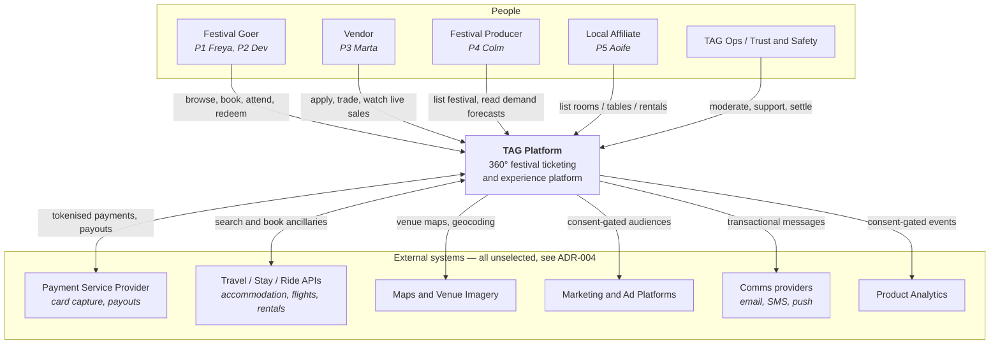
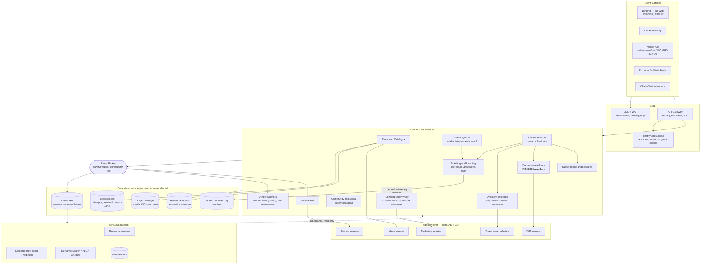
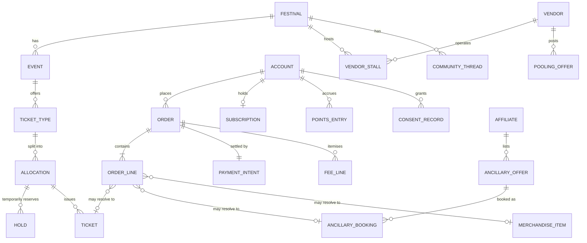
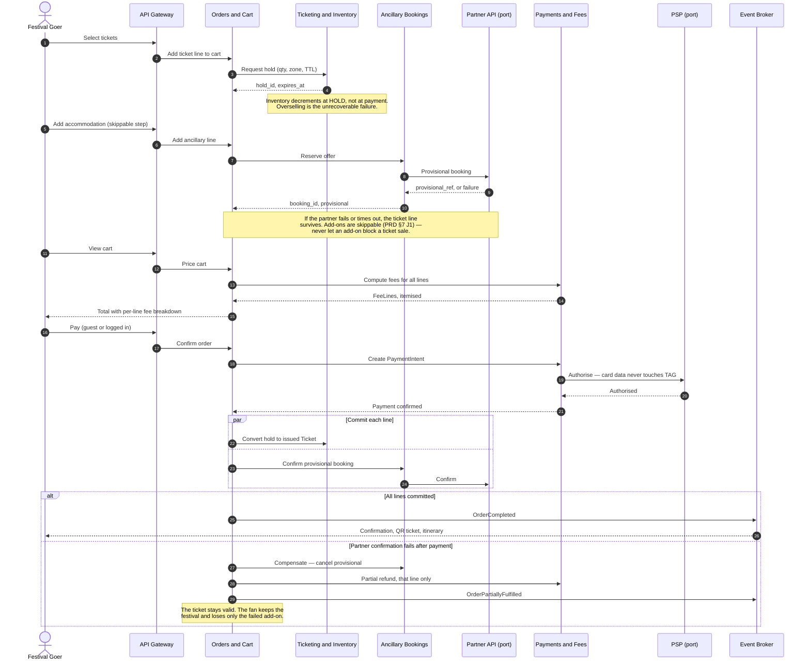
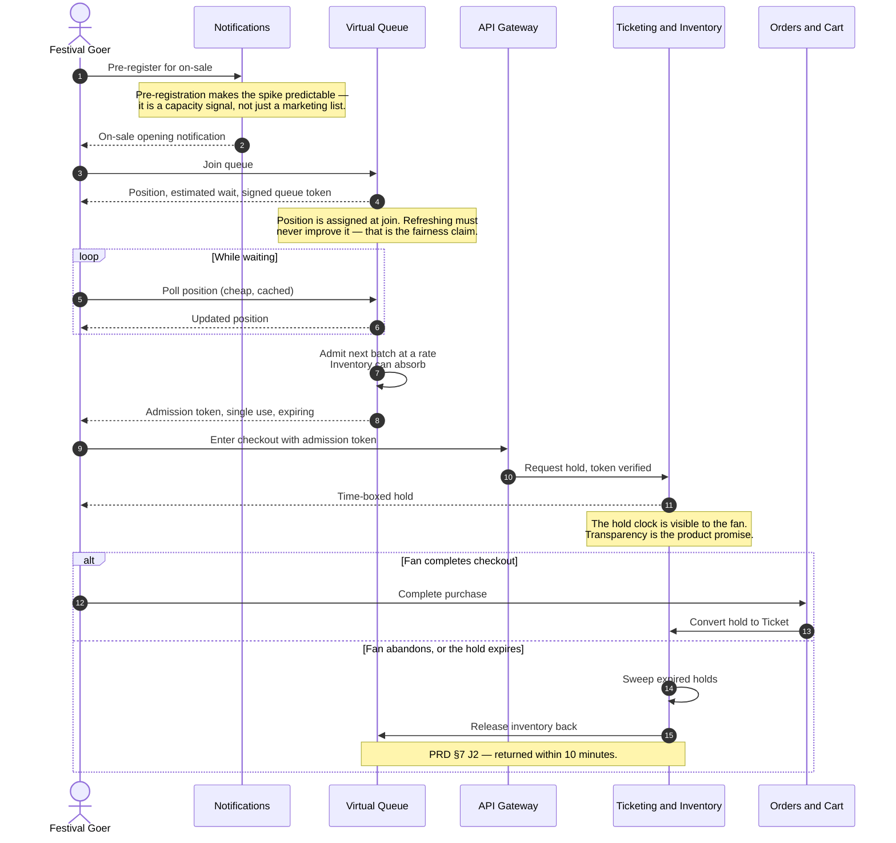
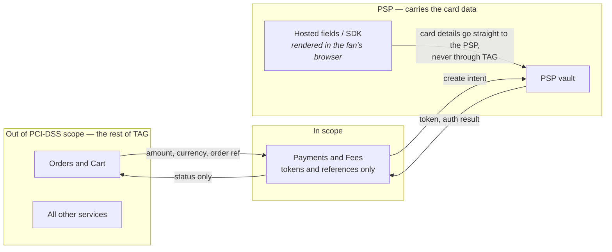

# TAG — Platform Architecture (v1)

**Product:** TAG 360° Festival Ticketing Platform
**Author:** Nitish (drafted with Claude)
**Date:** 23 August 2026
**Status:** Draft for review — not signed off
**Derived from:** `TAG_PRD_v2.md` (pinned scope document) §2, §7, §8, §10, §12, §13
**Document type:** Living until Phase 1 sign-off, then frozen as the v1 baseline.

> **Naming note.** **TAG** is the product name throughout the repo. The interim
> name "BMSx" was retired by the rename pass of 2026-08-23, which carried it
> across the PRD, rules files, README and landing page. It survives only where it
> is a historical record — `PROGRESS.md` decisions-log entries, `archive/`
> filenames, the `BMSx-synced` working directory and the `nitishiot/BMSx` remote.

> **Evidence discipline.** Every number in this document is either traceable to
> the PRD or marked `[TBD]`. No latency, throughput, or cost figure is asserted —
> there is no live system to measure, so per `.claude/rules/build.md` those stay
> `[TBD: no live system yet]` rather than being invented. Vendor names appear
> only where the PRD names them; the PSP and travel/stay partners are **not
> selected** (PRD §12, blocking question 2), so they are modelled as ports.

---

## How to read this document

Six views, each answering one question. They are progressively more detailed;
nothing below contradicts anything above.

| View | Question it answers |
|------|---------------------|
| 1. System context | What is TAG, who uses it, what does it depend on? |
| 2. Container view | What gets deployed, and what state does each piece own? |
| 3. Domain & data model | Which service owns which noun, and how do they refer to each other? |
| 4. Critical-path sequences | How do the two hardest journeys (J1, J2) actually execute? |
| 5. Cross-cutting concerns | Payments isolation, GDPR/DPDP, EU AI Act, observability, NFRs |
| 6. Decisions & open items | What has been decided, what is deliberately deferred |

Two views from the original outline — the enumerated event-backbone catalogue and
the Phase-1 build subset — were deliberately dropped for this revision at
Nitish's direction. The event backbone is still *described* in view 2; what is
missing is the publish/subscribe table. The Phase-1 subset moves into
`build/MVP1_<name>/PHASE_1_SPEC.md` when Phase 1 is scoped.

---

## Architecture principles

Carried forward from PRD §8, restated with the consequence each one imposes.

| # | Principle | Consequence for the design |
|---|-----------|----------------------------|
| A1 | **Burst-tolerant, pay-as-you-scale** | Festival on-sales are extreme but *scheduled* burst traffic. The virtual queue and ticket inventory must scale independently of everything else — and must be the only things that have to. |
| A2 | **Event-driven backbone** | Order, inventory and vendor events publish to a broker. Real-time vendor dashboards subscribe; they never poll the orders database. |
| A3 | **Payments isolation** | Card data never enters TAG's own systems. The PCI-DSS boundary is one service plus the PSP. |
| A4 | **AI as a platform layer** | Recommendations, demand prediction and NLP are consumed over internal APIs by any surface. They read from the data lake, never from a domain service's database. |
| A5 | **Compliance by design** | Consent is a service other services must check, not a checkbox on a form. Erasure is a workflow, not a `DELETE`. |
| A6 | **Multi-currency / multi-language in the model from day one** | Even though v1 ships Europe-only (PRD §4), money is never a bare number and user-facing strings are never hard-coded. Retrofitting this after launch is the expensive path. |
| A7 | **Vendor choices are ports, not commitments** | PSP, travel/stay/ride APIs, maps and marketing platforms are unselected (PRD §12). Each is an interface owned by TAG with a swappable adapter behind it. |

---

## View 1 — System context

Who and what TAG interacts with. Vocabulary is the PRD's: **Festival Goers**
(B2C) and **Festival Clients & Suppliers** (B2B — producers/promoters, vendors,
artists/management, local government & tourism).

**What this view fixes.** TAG is a four-sided marketplace, not a shop. Each of
the four counterparties both *supplies* something and *consumes* something,
which is why a single-sided ticketing data model does not fit: an Affiliate's
room and a Producer's ticket are both sellable inventory, and one Festival
Goer's order can contain both.

---

## View 2 — Container view

What actually gets deployed and what state each piece owns. This expands PRD §8
with the pieces that sketch omits: data stores, the message broker, the queue
service, the edge, and the consent service.

### Container responsibilities

| Container | Owns | Why it is separate |
|-----------|------|--------------------|
| **API Gateway** | Routing, TLS, rate limiting, request auth | One place to throttle an on-sale before it reaches a domain service. |
| **Identity & Access** | Accounts, sessions, guest tokens, roles | Guest checkout is required in PRD §7 J1 — an identity model assuming registration would block it. |
| **Event & Catalogue** | Festival, Event, Artist, Venue, Zone, seat-map geometry | Read-heavy, cacheable, and the only service the landing page needs at scale. |
| **Virtual Queue** | Queue position, admission tokens, fairness rules | **The most burst-exposed component.** Split out so an on-sale spike scales one small stateless service, not the whole platform. |
| **Ticketing & Inventory** | TicketType, Allocation, Hold, issued Ticket | Correctness-critical: overselling is unrecoverable. Holds are time-boxed and released on expiry (PRD §7 J2: within 10 minutes). |
| **Orders & Cart** | Cart, Order, OrderLine | Orchestrates the bundled-checkout saga across inventory, ancillaries and payment. |
| **Payments & Fees** | PaymentIntent, FeeLine, refund, payout, settlement | Holds the PCI-DSS boundary (A3). Fee transparency (PRD §7 J1) is computed here so cart and payment can never disagree. |
| **Ancillary Bookings** | Offer and Booking for stay / travel / meal / attraction | Wraps the unselected partner APIs; the rest of the platform never knows which partner served a booking. |
| **Subscriptions & Rewards** | Subscription, Tier, Rewards Points ledger | Points are money-like: an append-only ledger, not a mutable balance column. |
| **Vendor Services** | Vendor, Stall, application, pooling, live dashboards | Subscribes to sales events (A2) rather than querying Orders — this is the reason the broker exists. |
| **Community & Social** | Thread, Post, Report, ModerationAction | Moderation and report/block are launch-gating per PRD §9 story 7, so they are in scope for the service from the start. |
| **Notifications** | Preferences, delivery records, templates | Consent-gated; on-sale notifications are themselves a burst event. |
| **Consent & Privacy** | ConsentRecord, ErasureRequest, ResidencyPolicy | A first-class service rather than a shared library, because consent checks and erasure must be auditable across every other service. |

### On deployment granularity — a flagged concern

PRD §8 specifies "serverless microservices". That is the right *target*, and this
view is drawn as it. It is **not** the right thing to build first at current team
size. Thirteen independently deployed services impose distributed tracing,
contract versioning, saga debugging and thirteen deployment pipelines before a
single ticket has been sold.

**Decision (ADR-010, accepted 2026-08-23):** build v1 as a **modular monolith** with the
boundaries above enforced in code — separate modules, separate schemas, no
cross-module database access — and extract only the containers that genuinely
need it: **Virtual Queue** and **Ticketing & Inventory** for independent scaling
(A1), plus **Payments** for PCI scope isolation (A3). Every other boundary in
this diagram then stays a module boundary that can be pulled out later without a
rewrite, precisely because the data-ownership rule in View 3 was never violated.

This does not change the diagram. It changes what "one box" means at deploy time.
Nitish took this decision on 2026-08-23, in preference to the PRD §8 target of
thirteen independently deployed serverless services; the phase spec's component
structure follows from it.

---

## View 3 — Domain & data model

The rule that makes View 2 work: **each noun has exactly one owning service.**
Other services hold the identifier and nothing else — no shared tables, no
foreign keys across boundaries, no reading another service's database.

### Ownership map

| Owning service | Entities | Referenced elsewhere only as |
|----------------|----------|------------------------------|
| Identity & Access | `Account`, `Profile`, `Session`, `GuestToken` | `account_id` |
| Event & Catalogue | `Festival`, `Event`, `Artist`, `Venue`, `Zone`, `SeatMap` | `festival_id`, `event_id` |
| Ticketing & Inventory | `TicketType`, `Allocation`, `Hold`, `Ticket` | `ticket_id`, `hold_id` |
| Orders & Cart | `Cart`, `Order`, `OrderLine` | `order_id` |
| Payments & Fees | `PaymentIntent`, `FeeLine`, `Refund`, `Payout`, `Settlement` | `payment_intent_id` |
| Ancillary Bookings | `Affiliate`, `AncillaryOffer`, `AncillaryBooking` | `booking_id` |
| Subscriptions & Rewards | `Subscription`, `Tier`, `PointsEntry` | `subscription_id` |
| Vendor Services | `Vendor`, `VendorStall`, `VendorApplication`, `PoolingOffer` | `vendor_id` |
| Merchandise *(a Catalogue + Orders concern for v1, not its own service)* | `MerchandiseItem` | `sku` |
| Community & Social | `CommunityThread`, `Post`, `Report`, `ModerationAction` | `thread_id` |
| Consent & Privacy | `ConsentRecord`, `ErasureRequest`, `ResidencyPolicy` | `account_id` |

### Modelling rules that follow from the principles

1. **Money is never a bare number.** Every monetary field is `{amount_minor, currency}` with an ISO-4217 code (A6). Fees are `FeeLine` rows, never one blended total — PRD §7 J1 requires an itemised breakdown at cart, and a blended column makes honest rendering impossible.
2. **A `Ticket` is not an `OrderLine`.** An order line resolves to a ticket, an ancillary booking, or merchandise. This is what makes the 360° bundled checkout (G2, ≥ 15% attach) a first-class concept rather than a bolt-on.
3. **Rewards Points are an append-only ledger.** `PointsEntry` rows carry a reason and a source reference; the balance is derived. A mutable balance cannot be reconciled after a dispute.
4. **`Hold` is a real entity with an expiry**, not a flag on an allocation. J2's "queue drop-off returns inventory within 10 minutes" is an expiry sweep over holds.
5. **Translatable text lives in a side table keyed by locale** (A6), even though v1 is Europe-only.
6. **Every entity carrying personal data declares its erasure behaviour** — delete, anonymise, or retain under legal basis (financial records). This is a property of the model, not tribal knowledge, because View 5.2 depends on it.

---

## View 4 — Critical-path sequences

Two journeys decide whether this architecture works. Everything else is
comparatively ordinary CRUD.

### 4.1 — J1: the 360° bundled checkout

The hard part: one cart can hold a ticket (TAG's own inventory, strongly
consistent) *and* a hotel room (a partner's inventory, reachable only over an
API that can fail or time out). These cannot commit in one transaction.

**Approach: an orchestrated saga with per-line compensation, owned by Orders & Cart.**

**Design decisions this sequence forces:**

- **Inventory decrements at hold, not at payment.** The alternative oversells during exactly the minutes when it matters most.
- **Payment authorises once, for the whole cart.** Per-line payment multiplies PSP fees and gives the fan several charges to reconcile.
- **Partner failure after authorisation is a partial refund, never a whole-order rollback.** Cancelling a fan's festival ticket because a hotel API returned a 503 is the worst available outcome and contradicts PRD §7's "add-ons are non-intrusive" rule.
- **Every step is idempotent, keyed by `cart_id`.** Retries on a mobile network are normal, not exceptional.

### 4.2 — J2: high-demand on-sale with virtual queue

Fairness is a stated product promise (PRD §9 story 3; PRD §11 tracks fairness
complaints < 0.5%). Fairness here is an *architectural* property, not a UI one.

**Design decisions this sequence forces:**

- **The queue admits at a rate inventory can absorb.** This is the load-shedding mechanism: the queue converts an unbounded spike into a bounded arrival rate, so downstream services need not be sized for peak.
- **Position is assigned once, at join, and signed.** A client that can influence its own position is not a fair queue, and duplicate-account abuse throttling (PRD §7 J2) needs a token it can attribute.
- **Polling is served from cache, not from queue state.** Hundreds of thousands of clients polling a consistent store is itself the outage.
- **Admission tokens are single-use and expiring.** Otherwise the queue is bypassable by replay and the fairness promise fails silently.

`[TBD: queue-fairness operational definition. PRD §11 flags this as undefined —
the metric "fairness complaints < 0.5% of queued users" cannot be measured until
fairness is defined operationally.]`

---

## View 5 — Cross-cutting concerns

### 5.1 PCI-DSS boundary

TAG stores **payment tokens and references, never a PAN**. Card capture happens
in PSP-hosted fields rendered client-side, so card data never transits TAG
infrastructure. Target posture is the lightest applicable self-assessment —
`[TBD: confirm SAQ level with the selected PSP and a QSA; depends on PRD §12
blocking question 2]`.

### 5.2 GDPR (EU launch) and DPDP Act (India expansion)

| Obligation | Where it lives in this architecture |
|------------|-------------------------------------|
| **Lawful basis / consent** | Consent & Privacy service. Any service doing profiling, marketing or analytics checks it first — recommendation profiling requires opt-in per PRD §8 principle 5. |
| **Right to erasure** | An `ErasureRequest` fans out over the broker; each service applies its declared behaviour from View 3 rule 6. Financial records are retained under legal obligation, and that retention is documented rather than silent. |
| **Data minimisation** | The data lake receives *events*, not table dumps. Identifiers are pseudonymised at ingest, so AI training never requires raw personal data. |
| **Data residency** | EU-region deployment for v1. A `ResidencyPolicy` per account makes an India region additive rather than a migration (A6; PRD §4 non-goal 4). |
| **Portability** | Order and booking history exports use the same fan-out mechanism as erasure. |
| **DPIA** | Required for the recommendation/profiling systems. `[TBD: DPIA not started — PRD §14 item 7.]` |

### 5.3 EU AI Act

Three systems are in scope: recommendations, demand/pricing prediction, and the
NLP chatbot. PRD §8 assesses these as *likely* limited-risk with transparency
obligations. That assessment is not a legal classification.

`[TBD: EU AI Act classification — PRD §12 blocking question 4.]` Until legal
confirms: build the transparency affordances now (disclose that the chatbot is
AI, label AI-generated descriptions) because they are cheap now and expensive to
retrofit, and do not ship consumer-facing dynamic pricing.

### 5.4 Observability

Absent from PRD §8, but required before any target in §5.5 can be *measured*
rather than guessed:

- **Correlation ID** issued at the gateway and propagated through every service call and broker message. Without it, a saga failure in View 4.1 is undebuggable.
- **The four signals that matter at on-sale:** queue depth and admission rate; hold-to-order conversion; PSP authorisation latency and error rate; oversell count — which must be zero, and must alarm as a correctness bug, not a performance one.
- **Business metrics ride the same event stream** as the vendor dashboards. PRD §11's leading metrics derive from the lake, so instrumentation is not a separate project.

### 5.5 Non-functional targets

Per `.claude/rules/build.md`, a target that has not been measured is a
hypothesis. There is no live system, so these name *what must be measured*
rather than assert values.

| NFR | Status |
|-----|--------|
| Landing page LCP / TTI | The only NFRs with real numbers today: LCP < 2.5 s, TTI < 3.5 s on mid-range mobile over 4G (PRD LP-4). **PROJECTED** until measured. |
| On-sale concurrent queue entrants | `[TBD: no live system yet]` — must derive from a committed launch partner's audience (PRD §12 Q1). Festival audiences of 210K–600K (PRD §1) bound the problem; they are not a load target. |
| Checkout P50 / P95 / max latency | `[TBD: no live system yet]` |
| Inventory oversell rate | Target zero. A correctness invariant rather than a performance target — and testable before launch. |
| Broker delivery lag to vendor dashboards | `[TBD: no live system yet]` — "real-time" in PRD §9 story 8 needs a number before it can be signed off. |
| Recovery behaviour on service restart | `[TBD: verify live once a first phase exists]` |
| Backpressure on partner ancillary APIs | Must degrade to "add-ons unavailable, tickets still sellable" — testable by fault injection before launch. |
| Index/query coverage | Every hot query path gets a matching index, verified per phase. |

---

## View 6 — Decisions and open items

### Decisions taken in this document

| ID | Decision | Rationale | Status |
|----|----------|-----------|--------|
| ADR-001 | Burst tolerance centred on an independently scaled Virtual Queue | On-sales are the only extreme-load event, and they are scheduled, therefore predictable | Accepted (PRD §8 A1) |
| ADR-002 | Event-driven backbone over a durable broker | Vendor dashboards must not poll the orders store; the lake needs an append-only source | Accepted (PRD §8 A2). Broker product `[TBD]` |
| ADR-003 | Payments isolated; card data confined to PSP-hosted fields | Keeps every other service out of PCI-DSS scope | Accepted (PRD §8 A3) |
| ADR-004 | External dependencies modelled as ports with swappable adapters | PSP and travel/stay partners are unselected (PRD §12 Q2); architecture must not block on a commercial decision | Accepted |
| ADR-005 | One owning service per entity; no shared database, no cross-service foreign keys | The rule that lets ADR-010 defer deployment granularity without a later rewrite | Accepted |
| ADR-006 | Bundled checkout is an orchestrated saga with per-line compensation | TAG's own inventory and partner inventory cannot share a transaction | Accepted |
| ADR-007 | Inventory decrements at hold; holds expire and sweep back | Prevents overselling and delivers J2's 10-minute inventory return | Accepted |
| ADR-008 | Rewards Points as an append-only ledger | Points are money-like and must reconcile after disputes | Accepted |
| ADR-009 | Consent as a service other services must call | Consent checks and erasure must be auditable platform-wide, not by per-service convention | Accepted |
| ADR-010 | **Deployment granularity for v1: modular monolith, with Queue, Inventory and Payments extracted** | Thirteen deployment pipelines before the first ticket sells is cost without benefit at current team size; ADR-005 preserves the option to extract later | Accepted 2026-08-23 |

### Open items inherited from the PRD

These shape or block architecture but are not architectural questions:

1. **Launch partners** (PRD §12 Q1) — until one is committed, every load target is unbounded guesswork.
2. **PSP and travel/stay partner selection** (PRD §12 Q2) — gates the PCI-DSS SAQ level and the ancillary adapter contracts. ADR-004 keeps the build unblocked meanwhile.
3. **Fee and rebate mechanics** (PRD §12 Q3) — the `FeeLine` model can express any scheme, but the rebate's funding source decides whether it is a fee line, a points entry, or a settlement adjustment.
4. **EU AI Act classification** (PRD §12 Q4).
5. **Vendor app: native or responsive web** (PRD §12 Q6).
6. **Community moderation model** (PRD §12 Q7).

### Open items this document adds

7. `[TBD: cloud provider and event-broker product]` — the design is deliberately provider-neutral; choosing is a Phase-1 decision, not a PRD one.
8. `[TBD: queue-fairness operational definition]` — required before PRD §11's fairness metric is measurable.
9. `[TBD: PCI-DSS SAQ level]` — follows from item 2.
10. `[TBD: DPIA for profiling and recommendations]` — PRD §14 item 7, not started.
11. `[TBD: repo-surface classification]` — carried from `CLAUDE.md`. This document deliberately contains no founder names and no revenue-split figures, so it is safer to share than either PRD, but the classification is still undecided.

---

## What this document deliberately does not decide

- **Phase 1 scope.** That belongs in `build/MVP1_<name>/PHASE_1_SPEC.md`, written next.
- **The legacy `server/` / `client/` scaffold.** Still an open decision (`PROGRESS.md`); nothing here builds on it.
- **Technology selections.** No language, framework, cloud or database product is named. Those belong in the phase spec, where they can be justified against Phase 1's actual requirements rather than against the whole platform's eventual ones.

---

## Consolidated TBD list

| # | TBD | Owner | Blocks |
|---|-----|-------|--------|
| 1 | Launch festival partners committed for v1 | Commercial | All load targets |
| 2 | PSP selection | Commercial + Engineering | PCI SAQ level, payment adapter |
| 3 | Travel / stay / ride API partners; build vs. integrate | Commercial + Engineering | Ancillary adapter contracts |
| 4 | Fee and rebate mechanics, and who funds the rebate | Finance | Fee model detail |
| 5 | EU AI Act classification | Legal | Dynamic pricing and chatbot rollout |
| 6 | DPIA for profiling / recommendations | Legal / Privacy | Recommendation launch |
| 7 | Cloud provider and event-broker product | Engineering | Phase 1 spec |
| 8 | Queue-fairness operational definition | Product | Fairness success metric |
| 9 | Vendor app: native or responsive web | Engineering / Design | Vendor app phase |
| 10 | Community moderation model | Ops / Trust & Safety | Community launch |
| 11 | Repo-surface classification for this document | Nitish | External sharing |
| 12 | Every NFR target in §5.5 | Engineering | Phase sign-off criteria |

Two entries were closed on 2026-08-23: deployment granularity (ADR-010, decided —
modular monolith with Queue, Inventory and Payments extracted) and the BMSx→TAG
rename pass (done).
